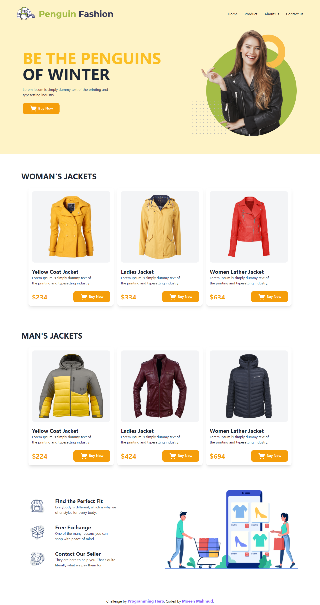

# Programming Hero - Penguin Fashion Landing Page Solution

This is a solution to the [Penguin Fashion Challenge on Programming Hero](https://github.com/ProgrammingHero1/penguin-fashion). Programming Hero is a great frontend web development bootcamp for those who have the passion for learning and coding. It helps you improve your coding skills by buiding realistic projects.

## Table of contents

- [Overview](#overview)
  - [The challenge](#the-challenge)
  - [Screenshot](#screenshot)
  - [Links](#links)
- [My process](#my-process)
  - [Built with](#built-with)
  - [What I learned](#what-i-learned)
  - [Continued development](#continued-development)
  - [Useful resources](#useful-resources)
- [Author](#author)

## Overview

### The challenge

Users should be able to view the optimal layout depending on their device's screen size.

### Screenshot

### Links

- Solution URL: [Git Repo](https://github.com/moeen-mahmud/penguin-fashion)
- Live Site URL: [Live Site](https://penguin-fashion.vercel.app/)

## My Process

### Built With

- HTML5 markup
- Tailwind CSS
- Mobile-first workflow

### What I learned

I learned the basics of Tailwind CSS by doing this project. I only use their cdn, so no dynamic options are included. I used flexbox and grid by following [Tailwind Css Documentation](https://tailwindcss.com/). This was fun and I love this framework.

### Continued Development

I really enjoy [Tailwind CSS](https://tailwindcss.com/) just for their utility first workflow. For that reason, I have most control on my code and design process. It is more fun than [Bootstrap](https://getbootstrap.com/).

### Useful resources

- [Tailwind CSS Documentation](https://tailwindcss.com/docs)
- [MDN](https://developer.mozilla.org/en-US/) - My go to site, if I get stucked.

## Author

- Facebook - [moeen.mahmud](https://www.facebook.com/moeen.mahmud)
- Twitter - [moeen_mahmud](https://twitter.com/moeen_mahmud)
